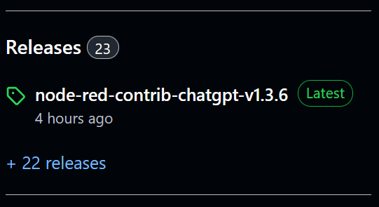

# Releases-To-Downloads-For-People-That-Arent-Nerds
Change the GitHub Releases text to say Downloads.

Screenshots
------------
### Before:

### After:

Installation
------------

First, install a plugin that enables UserScript. There are several plugins for each web browser:

- Chrome or Firefox: [Tampermonkey](https://www.tampermonkey.net/)
- Firefox: [Greasemonkey](https://addons.mozilla.org/en-US/firefox/addon/greasemonkey/)

Then, [click here to install](https://gist.github.com/HaroldPetersInskipp/591329c8aafe54db7b90e10f9c1e44ff/raw/ReleasesToDownloadsForPeopleThatArentNerds.user.js).
